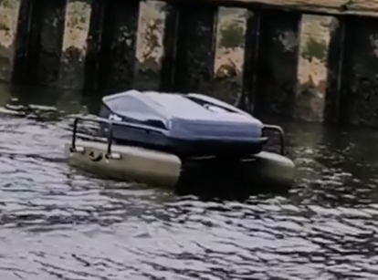

# USV-Project

During Semester 4 i participated in a project module where i built a radio network for a Unmanned surface vehicle using BBC microbits

<a href="https://github.com/Applied-Robotics-USV">Heres a link to the project repo</a>
